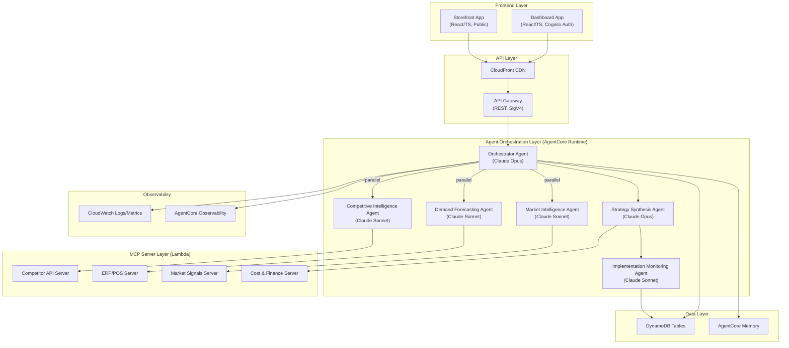
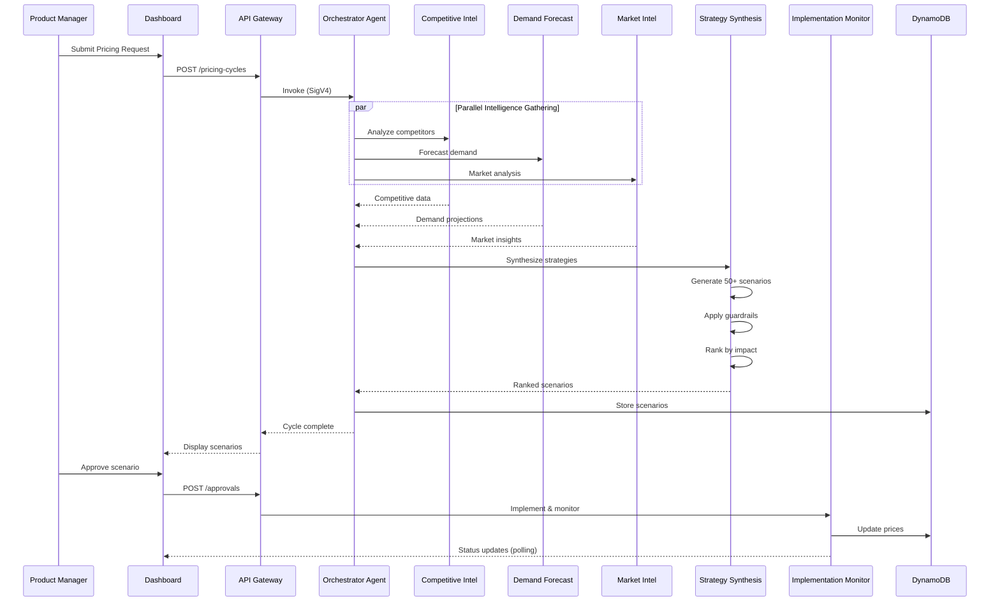

# Design Document: Retail Dynamic Pricing

## Overview

This design describes an MVP demo of an agentic AI-based dynamic pricing system for retail. The system replaces a manual 6-10 week pricing process with a multi-agent orchestrator that delivers 50+ ranked pricing scenarios in 2-4 days. It uses Amazon Bedrock AgentCore Runtime with the Strands Agents SDK, MCP Servers on Lambda for data integration, and two React/TypeScript frontends (an authenticated Dashboard and a public Storefront).

The architecture follows a hub-and-spoke multi-agent pattern: an Orchestrator Agent delegates to three intelligence agents in parallel, feeds their outputs to a Strategy Synthesis Agent, and hands off approved scenarios to an Implementation Monitoring Agent for closed-loop feedback.

### Key Design Decisions

| Decision | Choice | Rationale |
|----------|--------|-----------|
| Agent Framework | Strands Agents SDK on AgentCore Runtime | Native AWS integration, MCP support, managed infrastructure |
| Orchestrator Model | us.anthropic.claude-opus-4-7 | Complex reasoning for strategy synthesis and orchestration |
| Intelligence Agent Models | us.anthropic.claude-sonnet-4-6 | Cost-effective for data analysis tasks |
| Data Integration | MCP Servers on Lambda | Standardized tool protocol, serverless scaling, simulated data |
| Frontend | React/TypeScript + Vite + Tailwind | Modern stack, fast iteration, type safety |
| Hosting | AWS Amplify + CloudFront + API Gateway | Managed hosting, CDN, serverless backend |
| Data Store | DynamoDB (on-demand) | Serverless, pay-per-request, flexible schema |
| Auth | Amazon Cognito | Managed auth, JWT tokens, API Gateway integration |
| IaC | AWS CDK (Python) | Reproducible, parameterized, automatic rollback |
| API Auth to AgentCore | SigV4 HTTP calls | Required by AgentCore APIs (not boto3) |

## Architecture

### High-Level System Architecture



### Agent Execution Flow



### Session and Data Isolation Model

Each Pricing Cycle operates within an isolated AgentCore session scoped to a Pricing Group. Sessions ensure:

- **Data isolation**: No cross-session data leakage between concurrent pricing cycles
- **Coherent pricing**: Related products (e.g., different pack sizes) are evaluated together
- **Memory scoping**: Short-term memory is session-bound; long-term memory is queryable across sessions for historical learning

```
Session Scope: Pricing_Group (product family | sub-category | category)
├── Short-term Memory (24h TTL)
│   ├── Agent intermediate outputs
│   ├── Request parameters
│   └── Inter-agent messages
└── Long-term Memory (100 cycles)
    ├── Selected scenarios + outcomes
    ├── Revenue/margin results
    └── Approval decisions
```

## Components and Interfaces

### 1. Orchestrator Agent

**Responsibility**: Receives pricing requests, manages agent lifecycle, enforces timeouts and retries, assembles final output.

**Configuration**:
- Model: `us.anthropic.claude-opus-4-7`
- Timeout per sub-agent: 120 seconds
- Retry policy: 2 retries per agent, then graceful degradation
- Session scope: Pricing_Group level

**Interface**:
```python
# Strands Agent definition
from strands import Agent
from strands.tools.mcp import MCPClient

orchestrator = Agent(
    model="us.anthropic.claude-opus-4-7",
    system_prompt=ORCHESTRATOR_SYSTEM_PROMPT,
    tools=[invoke_intelligence_agents, invoke_synthesis, invoke_monitoring]
)
```

### 2. Intelligence Agents (Competitive, Demand, Market)

**Responsibility**: Each agent specializes in one data domain, queries its MCP Server, and returns structured analysis.

**Configuration**:
- Model: `us.anthropic.claude-sonnet-4-6`
- Each agent has access to one primary MCP Server
- Output: Structured JSON conforming to agent-specific schema

**MCP Tool Bindings**:
| Agent | MCP Server | Tools Exposed |
|-------|-----------|---------------|
| Competitive Intelligence | Competitor API Server | `get_competitor_prices`, `get_price_history`, `get_market_position` |
| Demand Forecasting | ERP/POS Server | `get_sales_history`, `get_pos_realtime`, `get_inventory_levels`, `get_elasticity_data` |
| Market Intelligence | Market Signals Server | `get_market_trends`, `get_consumer_sentiment`, `get_macro_indicators` |

### 3. Strategy Synthesis Agent

**Responsibility**: Combines intelligence outputs, applies guardrails, generates 50-200 ranked scenarios.

**Configuration**:
- Model: `us.anthropic.claude-opus-4-7`
- MCP Server: Cost & Finance Server
- Tools: `get_cost_structure`, `get_margin_targets`, `get_financial_constraints`
- Output: Array of PricingScenario objects, ranked by composite impact score

### 4. Implementation Monitoring Agent

**Responsibility**: Executes approved price changes, tracks KPIs, triggers closed-loop adjustments.

**Configuration**:
- Model: `us.anthropic.claude-sonnet-4-6`
- Polling interval: ≤60 minutes for performance metrics
- Variance thresholds: 10% revenue, 3pp margin

### 5. MCP Servers (Lambda Functions)

Each MCP Server is a Lambda function implementing the Model Context Protocol. For the MVP demo, they return randomized data within realistic bounds.

**Randomization Bounds**:
| Server | Data | Variance |
|--------|------|----------|
| Competitor API | Competitor prices | ±10% from baseline |
| ERP/POS | Demand volumes | ±20% from baseline |
| Market Signals | Sentiment scores | Variable between invocations |
| Cost & Finance | Cost inputs | ±5% from baseline |

**Lambda Configuration**:
- Runtime: Python 3.12
- Timeout: 30 seconds
- Memory: 256 MB
- Response format: JSON with `status` and `data` fields

### 6. Dashboard Application

**Stack**: React 18, TypeScript, Vite, Tailwind CSS, Axios
**Auth**: Amazon Cognito (JWT)
**Hosting**: AWS Amplify + CloudFront

**Key Views**:
- Pricing Request Form (Pricing Group, objectives, constraints)
- Agent Status Panel (real-time, ≤5s refresh)
- Scenario List (paginated, 20/page, ranked)
- Approval Workflow (approve/reject/modify with comments)
- AI Sidebar (rationale, process flow)
- Monitoring Panel (actual vs. projected, trend charts)

### 7. Storefront Application

**Stack**: React 18, TypeScript, Vite, Tailwind CSS
**Auth**: None (public)
**Hosting**: AWS Amplify + CloudFront

**Features**:
- Product catalog with images, descriptions, prices
- Live price updates within 60s of approval
- Visual change indicator for prices updated in last 24h

### 8. API Gateway

**Endpoints**:

| Method | Path | Auth | Description |
|--------|------|------|-------------|
| POST | /pricing-cycles | Cognito | Initiate a pricing cycle |
| GET | /pricing-cycles/{id} | Cognito | Get cycle status and scenarios |
| GET | /pricing-cycles/{id}/scenarios | Cognito | List scenarios (paginated) |
| POST | /approvals | Cognito | Approve/reject a scenario |
| GET | /agents/status | Cognito | Get agent execution status |
| GET | /monitoring/{scenarioId} | Cognito | Get monitoring metrics |
| GET | /products | None | Product catalog (storefront) |
| GET | /products/{id} | None | Single product detail |

**CORS Configuration**: `allowOrigins: ["https://dashboard.example.com", "https://storefront.example.com"]` — no wildcard with credentials.

### 9. Guardrails Engine

A pure-function validation layer applied by the Strategy Synthesis Agent before finalizing scenarios.

**Rules**:
1. **Below-cost rejection**: `price >= total_unit_cost`
2. **MAP enforcement**: `price >= minimum_advertised_price` (when MAP applies)
3. **Geographic bias**: `max_regional_variance <= threshold%` (default 15%)
4. **PII protection**: No customer-identifiable data in agent communications or outputs

**Risk Classification**:
| Level | Criteria | Action |
|-------|----------|--------|
| Low | ≤5% price change AND ≤2pp margin impact | Auto-approve |
| Medium | 5-15% price change OR 2-5pp margin impact | Human review |
| High | >15% price change OR >5pp margin OR >20% deviation from 90-day avg | Exception handling |

## Data Models

### DynamoDB Tables

#### PricingCycles Table

| Attribute | Type | Description |
|-----------|------|-------------|
| PK: `cycleId` | String (ULID) | Unique pricing cycle identifier |
| SK: `status` | String | INITIATED, ANALYZING, SYNTHESIZING, COMPLETE, FAILED |
| pricingGroup | String | Product family/sub-category/category |
| pricingGroupType | String | PRODUCT_FAMILY, SUB_CATEGORY, CATEGORY |
| objectives | List<String> | Strategic objectives selected |
| constraints | Map | { minMargin, maxPriceChange, channelRestrictions } |
| agentStatuses | Map | { agentId: { status, startTime, endTime, error } } |
| scenarioCount | Number | Total scenarios generated |
| requestedBy | String | Cognito user ID |
| createdAt | String (ISO 8601) | Cycle initiation timestamp |
| completedAt | String (ISO 8601) | Cycle completion timestamp |
| sessionId | String | AgentCore session ID |

#### PricingScenarios Table

| Attribute | Type | Description |
|-----------|------|-------------|
| PK: `cycleId` | String | Parent pricing cycle |
| SK: `scenarioId` | String (ULID) | Unique scenario identifier |
| rank | Number | Ordinal rank (1 = best) |
| confidenceScore | Number | 0-100 integer |
| statusLabel | String | Recommended, Review Required, Human Exception Handling |
| riskLevel | String | LOW, MEDIUM, HIGH |
| priceChanges | List<Map> | [{ productId, currentPrice, newPrice, changePercent }] |
| projectedRevenue | Number | Projected revenue impact (4 decimal places) |
| projectedMargin | Number | Projected margin (4 decimal places) |
| projectedMarketShare | Number | Projected market share change |
| compositeScore | Number | Weighted business impact score |
| competitiveFactors | Map | Data from Competitive Intelligence Agent |
| demandFactors | Map | Data from Demand Forecasting Agent |
| marketFactors | Map | Data from Market Intelligence Agent |
| guardrailResults | List<Map> | [{ rule, passed, reason }] |
| approvalStatus | String | PENDING, APPROVED, REJECTED |
| approvalComment | String | Free-text from Product Manager |
| approvedBy | String | Cognito user ID |
| approvedAt | String (ISO 8601) | Approval timestamp |
| createdAt | String (ISO 8601) | Scenario creation timestamp |

#### Products Table

| Attribute | Type | Description |
|-----------|------|-------------|
| PK: `productId` | String (ULID) | Unique product identifier |
| name | String | Product display name |
| description | String | Product description |
| imageUrl | String | Product image URL |
| category | String | Product category |
| subCategory | String | Product sub-category |
| productFamily | String | Product family |
| currentPrice | Number | Current active price (4 decimal places) |
| previousPrice | Number | Price before last update |
| priceUpdatedAt | String (ISO 8601) | Last price update timestamp |
| totalUnitCost | Number | Total unit cost (for guardrails) |
| mapPrice | Number | Minimum Advertised Price (nullable) |
| channels | List<String> | Sales channels |
| regions | List<String> | Geographic regions |

#### AuditTrail Table

| Attribute | Type | Description |
|-----------|------|-------------|
| PK: `scenarioId` | String | Scenario being evaluated |
| SK: `timestamp#ruleId` | String | Composite sort key |
| guardrailRule | String | Rule name evaluated |
| result | String | PASSED, REJECTED, FLAGGED |
| violationReason | String | Reason if rejected/flagged |
| agentId | String | Agent that triggered evaluation |
| cycleId | String | Parent pricing cycle |

#### Approvals Table

| Attribute | Type | Description |
|-----------|------|-------------|
| PK: `scenarioId` | String | Scenario under review |
| SK: `timestamp` | String (ISO 8601) | Action timestamp |
| action | String | APPROVED, REJECTED, ESCALATED |
| actorId | String | Cognito user ID |
| comment | String | Free-text justification |
| riskLevel | String | LOW, MEDIUM, HIGH |
| escalationDeadline | String (ISO 8601) | 48h deadline for escalation |

### Pricing Scenario JSON Schema

```json
{
  "$schema": "http://json-schema.org/draft-07/schema#",
  "type": "object",
  "required": ["scenarioId", "cycleId", "rank", "confidenceScore", "statusLabel",
               "riskLevel", "priceChanges", "projectedRevenue", "projectedMargin",
               "compositeScore", "competitiveFactors", "demandFactors", "marketFactors"],
  "properties": {
    "scenarioId": { "type": "string" },
    "cycleId": { "type": "string" },
    "rank": { "type": "integer", "minimum": 1 },
    "confidenceScore": { "type": "integer", "minimum": 0, "maximum": 100 },
    "statusLabel": { "type": "string", "enum": ["Recommended", "Review Required", "Human Exception Handling"] },
    "riskLevel": { "type": "string", "enum": ["LOW", "MEDIUM", "HIGH"] },
    "priceChanges": {
      "type": "array",
      "items": {
        "type": "object",
        "required": ["productId", "currentPrice", "newPrice", "changePercent"],
        "properties": {
          "productId": { "type": "string" },
          "currentPrice": { "type": "number" },
          "newPrice": { "type": "number" },
          "changePercent": { "type": "number" }
        }
      }
    },
    "projectedRevenue": { "type": "number" },
    "projectedMargin": { "type": "number" },
    "projectedMarketShare": { "type": "number" },
    "compositeScore": { "type": "number" },
    "competitiveFactors": { "type": "object" },
    "demandFactors": { "type": "object" },
    "marketFactors": { "type": "object" },
    "guardrailResults": {
      "type": "array",
      "items": {
        "type": "object",
        "required": ["rule", "passed"],
        "properties": {
          "rule": { "type": "string" },
          "passed": { "type": "boolean" },
          "reason": { "type": "string" }
        }
      }
    }
  }
}
```

### MCP Server Response Schema

```json
{
  "type": "object",
  "required": ["status", "data"],
  "properties": {
    "status": { "type": "string", "enum": ["success", "error"] },
    "data": { "type": "object" },
    "error": {
      "type": "object",
      "properties": {
        "code": { "type": "string" },
        "message": { "type": "string" }
      }
    },
    "metadata": {
      "type": "object",
      "properties": {
        "timestamp": { "type": "string", "format": "date-time" },
        "source": { "type": "string" },
        "latencyMs": { "type": "integer" }
      }
    }
  }
}
```

## Correctness Properties

*A property is a characteristic or behavior that should hold true across all valid executions of a system — essentially, a formal statement about what the system should do. Properties serve as the bridge between human-readable specifications and machine-verifiable correctness guarantees.*

### Property 1: Scenario ranking is contiguous and ordered by composite score

*For any* set of generated Pricing Scenarios, the ranks SHALL form a contiguous sequence from 1 to N (no gaps, no duplicates), and for any two scenarios with ranks i and j where i < j, the composite score of scenario i SHALL be greater than or equal to the composite score of scenario j.

**Validates: Requirements 1.3, 3.2**

### Property 2: MCP Server responses conform to schema

*For any* valid tool invocation to any MCP Server, the returned JSON response SHALL contain a `status` field (either "success" or "error") and a `data` field (object), conforming to the MCP Server Response Schema.

**Validates: Requirements 2.5**

### Property 3: MCP Server data within variance bounds

*For any* sequence of invocations to an MCP Server, all returned numeric values SHALL fall within the specified variance bounds from the baseline: competitor prices within ±10%, demand volumes within ±20%, and cost inputs within ±5%.

**Validates: Requirements 2.6**

### Property 4: Scenario count within bounds

*For any* valid set of intelligence agent outputs passed to the Strategy Synthesis Agent, the number of generated Pricing Scenarios that pass guardrail validation SHALL be between 50 and 200 inclusive, or if fewer than 50 pass validation, a shortfall notification SHALL be included in the output.

**Validates: Requirements 3.1, 3.6**

### Property 5: Confidence scores are valid integers

*For any* generated Pricing Scenario, the confidence score SHALL be an integer value in the range [0, 100] inclusive.

**Validates: Requirements 3.3**

### Property 6: Guardrail-violating scenarios excluded from output

*For any* Pricing Scenario that violates at least one guardrail rule (below-cost, MAP violation, or geographic bias exceeding threshold), that scenario SHALL NOT appear in the final ranked output list.

**Validates: Requirements 3.4, 8.6**

### Property 7: Each scenario references all three intelligence agents

*For any* Pricing Scenario in the final output, the `competitiveFactors`, `demandFactors`, and `marketFactors` fields SHALL each be non-empty objects containing at least one data point from their respective intelligence agent.

**Validates: Requirements 3.5**

### Property 8: Status label matches risk classification

*For any* Pricing Scenario, the status label SHALL be "Recommended" when riskLevel is LOW, "Review Required" when riskLevel is MEDIUM, and "Human Exception Handling" when riskLevel is HIGH.

**Validates: Requirements 3.7**

### Property 9: Risk classification follows threshold rules

*For any* Pricing Scenario with a given price change percentage and margin impact, the risk classification SHALL be: LOW when price change ≤ 5% AND margin impact ≤ 2 percentage points; MEDIUM when price change is between 5% and 15% (exclusive) OR margin impact is between 2 and 5 percentage points (exclusive); HIGH when price change ≥ 15% OR margin impact ≥ 5 percentage points OR deviation from 90-day average ≥ 20%.

**Validates: Requirements 7.4**

### Property 10: Approval routing matches risk level

*For any* Pricing Scenario, the approval workflow routing action SHALL be: auto-approve for LOW risk, route to Product Manager for human review for MEDIUM risk, and route to Product Manager as exception (requiring ≥50 character justification) for HIGH risk.

**Validates: Requirements 7.1, 7.2, 7.3**

### Property 11: Below-cost guardrail rejects correctly

*For any* Pricing Scenario where the recommended price for any product is less than that product's total unit cost, the below-cost guardrail SHALL reject the scenario.

**Validates: Requirements 8.1**

### Property 12: MAP guardrail rejects correctly

*For any* Pricing Scenario where the recommended price for a product with a MAP constraint is less than the Minimum Advertised Price, the MAP guardrail SHALL reject the scenario.

**Validates: Requirements 8.2**

### Property 13: Geographic bias guardrail flags correctly

*For any* Pricing Scenario where the price variance across geographic regions for the same product exceeds the configured threshold percentage of the mean price, the geographic bias guardrail SHALL flag the scenario.

**Validates: Requirements 8.3**

### Property 14: Variance detection triggers adjustment correctly

*For any* pair of actual and projected performance values, the Implementation Monitoring Agent SHALL trigger an adjustment recommendation if and only if the revenue variance exceeds 10% OR the margin variance exceeds 3 percentage points.

**Validates: Requirements 9.3**

### Property 15: Pricing Scenario serialization round trip

*For any* valid Pricing Scenario object, serializing it to JSON and then deserializing the JSON back to a Pricing Scenario object SHALL produce an object with identical field names, data types, and values, where numeric fields match to at least 4 decimal places.

**Validates: Requirements 14.5, 14.4**

### Property 16: Schema validation rejects invalid payloads

*For any* JSON payload that is missing a required field or contains a field with an incorrect data type as defined by the Pricing Scenario schema, deserialization SHALL reject the payload and return an error indication without processing the invalid data.

**Validates: Requirements 14.2, 14.3**

## Error Handling

### Agent Failure Strategy

| Failure Type | Response | Recovery |
|-------------|----------|----------|
| Agent timeout (>120s) | Terminate task | Retry up to 2x, then degrade |
| Agent error response | Log error | Retry up to 2x, then degrade |
| All retries exhausted | Flag incomplete | Proceed with available outputs, notify Dashboard |
| MCP Server timeout (>30s) | Wait 2s | Single retry, then mark unavailable |
| MCP Server error | Log error | Exclude data source, continue |
| AgentCore Browser unavailable | Log fallback | Use Competitor API MCP Server |
| Serialization failure | Reject payload | Log validation error, return error to sender |
| Guardrail violation | Exclude scenario | Log to audit trail, continue with valid scenarios |

### Graceful Degradation

The system operates in degraded mode when one or more intelligence agents fail:
- **2 of 3 agents succeed**: Generate scenarios with available data, flag missing analysis in output
- **1 of 3 agents succeed**: Generate limited scenarios, prominently warn about incomplete analysis
- **0 of 3 agents succeed**: Fail the pricing cycle, notify Product Manager

### Error Response Format

```json
{
  "error": {
    "code": "AGENT_TIMEOUT",
    "message": "Competitive Intelligence Agent exceeded 120s timeout",
    "agentId": "competitive-intelligence",
    "cycleId": "01HXYZ...",
    "timestamp": "2024-01-15T10:30:00Z",
    "retryCount": 2,
    "recoveryAction": "DEGRADED_CONTINUE"
  }
}
```

### Dashboard Error States

- **Authentication failure**: Redirect to login with error message
- **API timeout**: Show retry button with exponential backoff
- **Agent failure during demo**: Display failed agent indicator, offer restart
- **Storefront data unavailable**: Show "temporarily unavailable" message, auto-retry in 10s

## Testing Strategy

### Unit Tests

Unit tests cover pure business logic functions:
- **Guardrail validation functions**: Below-cost check, MAP check, geographic bias check
- **Risk classification function**: Threshold-based classification logic
- **Approval routing function**: Risk level to action mapping
- **Scenario ranking function**: Composite score calculation and ordering
- **Variance detection function**: Actual vs. projected threshold comparison
- **Serialization/deserialization**: JSON schema conformance and round-trip integrity

### Property-Based Tests

Property-based tests validate universal correctness properties using `hypothesis` (Python) for backend logic and `fast-check` (TypeScript) for frontend validation logic.

**Configuration**:
- Minimum 100 iterations per property test
- Each test tagged with: `Feature: retail-dynamic-pricing, Property {N}: {title}`
- Custom generators for PricingScenario, Product, and MCP response objects

**Backend (Python/hypothesis)**:
- Properties 1-7, 9, 11-16 (guardrails, risk classification, serialization, scenario generation)

**Frontend (TypeScript/fast-check)**:
- Properties 8, 10 (status label display, approval routing UI logic)

### Integration Tests

- Agent-to-agent communication via AgentCore Runtime
- MCP Server invocation and response handling
- DynamoDB read/write operations
- Cognito authentication flow
- API Gateway endpoint routing
- AgentCore Memory read/write
- End-to-end pricing cycle (happy path)

### E2E Tests

- Dashboard: Pricing request submission → agent status → scenario display → approval
- Storefront: Price update propagation within 60s
- Demo flow: Step-by-step guided walkthrough

### CDK Infrastructure Tests

- Snapshot tests for all CDK stacks
- Assertion tests for critical resource configurations (DynamoDB on-demand, CORS settings, Lambda timeouts)

### Test Execution Order

1. Unit tests + Property tests (fast, no external dependencies)
2. Integration tests (require AWS resources)
3. E2E tests (require full deployment)
4. CDK snapshot tests (during `cdk synth`)

